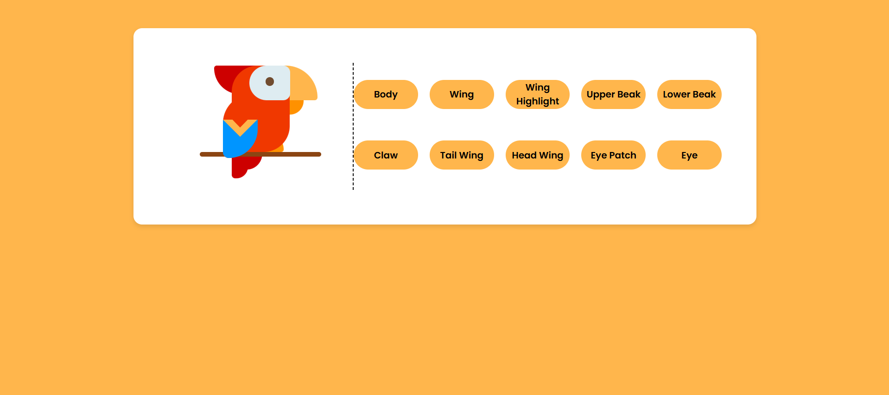

# Color the Parrot

A web-based application to customize a parrot design's colors and enhance user interaction through various controls.

## Features

- **Interactive Design**: Customize the parrot's body, wings, beak, tail, claws, and other elements using buttons.
- **Color Variations**: A variety of predefined colors to apply to each section of the design.
- **Responsive Layout**: The application adapts to various screen sizes for an optimal user experience.

## How to Use

1. Open the application in any modern web browser.
2. Use the buttons provided to change the colors of different parts of the parrot, such as:
   - Body
   - Wings (Main and Sub)
   - Beak (Upper and Lower)
   - Claws
   - Tail
   - Head feathers
   - Eye and eye patch
3. Experiment with color combinations to create your personalized parrot design.

## Screenshot
Here is an example of how the customized parrot design might look:



## Technologies Used

- **HTML5** for structuring the content.
- **CSS3** for styling and layout.
- **JavaScript** for dynamic functionality and user interactions.

## File Structure
```
├── index.html       # Main HTML file
├── styles.css       # CSS file for styling
├── script.js        # JavaScript file for functionality
└── README.md        # Documentation
```

## Responsive Design

The application is built with responsiveness in mind:
- On screens narrower than 750px, the layout adjusts to a single-column format for better usability.
- The buttons and controls scale appropriately for smaller devices.

# Parrot Design Customizer

A web-based application to customize a parrot design's colors and enhance user interaction through various controls.

## Features

- **Interactive Design**: Customize the parrot's body, wings, beak, tail, claws, and other elements using buttons.
- **Color Variations**: A variety of predefined colors to apply to each section of the design.
- **Responsive Layout**: The application adapts to various screen sizes for an optimal user experience.

## How to Use

1. Open the application in any modern web browser.
2. Use the buttons provided to change the colors of different parts of the parrot, such as:
   - Body
   - Wings (Main and Sub)
   - Beak (Upper and Lower)
   - Claws
   - Tail
   - Head feathers
   - Eye and eye patch
3. Experiment with color combinations to create your personalized parrot design.

## Technologies Used

- **HTML5** for structuring the content.
- **CSS3** for styling and layout.
- **JavaScript** for dynamic functionality and user interactions.

## Responsive Design

The application is built with responsiveness in mind:
- On screens narrower than 750px, the layout adjusts to a single-column format for better usability.
- The buttons and controls scale appropriately for smaller devices.

## Contribution

Contributions are welcome! If you'd like to improve this project:

1. Fork the repository.
2. Create a new branch: `git checkout -b feature/your-feature-name`.
3. Make your changes and commit them: `git commit -m 'Add some feature'`.
4. Push the changes to your branch: `git push origin feature/your-feature-name`.
5. Open a pull request and describe the enhancements or fixes you’ve made.

Feel free to suggest new features, improve code quality, or update the design. Let's make this project better together!
---

Enjoy! Have fun.

